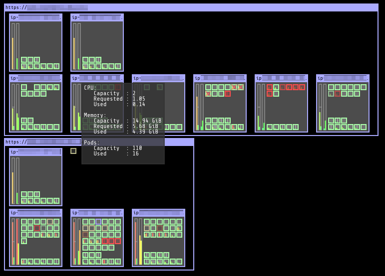

===========================
Kubernetes Operational View
===========================

.. image:: https://travis-ci.org/hjacobs/kube-ops-view.svg?branch=master
   :target: https://travis-ci.org/hjacobs/kube-ops-view
   :alt: Travis CI Build Status

.. image:: https://readthedocs.org/projects/kubernetes-operational-view/badge/?version=latest
   :target: http://kubernetes-operational-view.readthedocs.io/en/latest/?badge=latest
   :alt: Documentation Status

.. image:: 	https://img.shields.io/docker/pulls/hjacobs/kube-ops-view.svg
   :target: https://hub.docker.com/r/hjacobs/kube-ops-view
   :alt: Docker pulls

.. image:: https://img.shields.io/badge/calver-YY.MM.MICRO-22bfda.svg
   :target: http://calver.org
   :alt: Calendar Versioning

Goal: provide a common operational picture for multiple Kubernetes clusters.

* Render nodes and indicate their overall status ("Ready")
* Show node capacity and resource usage (CPU, memory)

  * Render one "box" per CPU and fill up to sum of pod CPU requests/usage
  * Render vertical bar for total memory and fill up to sum of pod memory requests/usage

* Render individual pods

  * Indicate pod status by border line color (green: ready/running, yellow: pending, red: error etc)
  * Show current CPU/memory usage (gathered from Heapster) by small vertical bars
  * System pods ("kube-system" namespace) will be grouped together at the bottom

* Provide tooltip information for nodes and pods
* Animate pod creation and termination

What it is not:

* It's not a replacement for the `Kubernetes Dashboard`_. The Kubernetes Dashboard is a general purpose UI which allows managing applications.
* It's not a monitoring solution. Use your preferred monitoring system to alert on production issues.
* It's not a operation management tool. Kubernetes Operational View does not allow interacting with the actual cluster.

Usage
=====

Running Locally
---------------

You can run the app locally with ``kubectl proxy`` against your running cluster:

.. code-block:: bash

    $ kubectl proxy &
    $ docker run -it --net=host hjacobs/kube-ops-view

If you are using Docker for Mac, this needs to be slightly different in order to navigate the VM/container inception:

.. code-block:: bash

    $ kubectl proxy --accept-hosts '.*' &
    $ docker run -it -p 8080:8080 -e CLUSTERS=http://docker.for.mac.localhost:8001 hjacobs/kube-ops-view

Now direct your browser to http://localhost:8080

You can also try the UI with the integrated mock mode. This does not require any Kubernetes cluster access:

.. code-block:: bash

    $ docker run -it -p 8080:8080 hjacobs/kube-ops-view --mock

Installation
------------

You can find example Kubernetes manifests for deployment in the ``deploy`` folder.
It should be as simple as:

.. code-block:: bash

    $ kubectl apply -f deploy  # apply all manifests from the folder

Afterwards you can open "kube-ops-view" via kubectl port-forward:

.. code-block:: bash

    $ kubectl port-forward service/kube-ops-view 8080:80

Now direct your browser to http://localhost:8080/

`Kubernetes Operational View is also available as a Helm Chart`_.

.. _Kubernetes Operational View is also available as a Helm Chart: https://kubeapps.com/charts/stable/kube-ops-view

Development
===========

The app can be started in "mock mode" to work on UI features without running any Kubernetes cluster:

.. code-block:: bash

    $ pipenv install && pipenv shell
    $ (cd app && npm start &)  # watch and compile JS bundle
    $ python3 -m kube_ops_view --mock --debug

Building
========

The provided ``Makefile`` will generate a Docker image by default:

.. code-block:: bash

    $ make

Multiple Clusters
=================

Multiple clusters are supported by passing a list of API servers, reading a kubeconfig file or pointing to an HTTP Cluster Registry endpoint.

See the `documentation on multiple clusters`_ for details.

.. _documentation on multiple clusters: https://kubernetes-operational-view.readthedocs.io/en/latest/multiple-clusters.html

Configuration
=============

The following environment variables are supported:

``AUTHORIZE_URL``
    Optional OAuth 2 authorization endpoint URL for protecting the UI.
``ACCESS_TOKEN_URL``
    Optional token endpoint URL for the OAuth 2 Authorization Code Grant flow.
``SCOPE``
    Optional scope specifies level of access that the application is requesting.
``CLUSTERS``
    Comma separated list of Kubernetes API server URLs. It defaults to ``http://localhost:8001/`` (default endpoint of ``kubectl proxy``).
``CLUSTER_REGISTRY_URL``
    URL to cluster registry returning list of Kubernetes clusters.
``CREDENTIALS_DIR``
    Directory to read (OAuth) credentials from --- these credentials are only used for non-localhost cluster URLs.
``DEBUG``
    Set to "true" for local development to reload code changes.
``KUBECONFIG_PATH``
    Path to kubeconfig file to use for cluster access.
``KUBECONFIG_CONTEXTS``
    Comma separated list of contexts to use when reading the kubeconfig file from ``KUBECONFIG_PATH``.
``MOCK``
    Set to "true" to mock Kubernetes cluster data.
``QUERY_INTERVAL``
    Interval in seconds for querying clusters (default: 5). Each cluster will at most queried once per configured interval.
``REDIS_URL``
    Optional Redis server to use for pub/sub events and job locking when running more than one replica. Example: ``redis://my-redis:6379``
``SERVER_PORT``
    HTTP port to listen on. It defaults to ``8080``.
``NODE_LINK_URL_TEMPLATE``
    Template to make Nodes clickable, e.g. can point to `kube-web-view <https://codeberg.org/hjacobs/kube-web-view/>`_. ``{cluster}`` (cluster ID) and ``{name}`` (Node name) will be replaced in the URL template.
``POD_LINK_URL_TEMPLATE``
    Template to make Pods clickable, e.g. can point to `kube-web-view <https://codeberg.org/hjacobs/kube-web-view/>`_. ``{cluster}`` (cluster ID), ``{namespace}`` (Pod's namespace), and ``{name}`` (Pod name) will be replaced in the URL template.

Supported Browsers
==================

The UI uses WebGL, ECMAScript 6, and EventSource features.
The following browsers are known to work:

* Chrome/Chromium 53.0+
* Mozilla Firefox 49.0+

See the `ECMAScript 6 Compatibility Table`_ for details on supported browser versions.

Contributing
============

Easiest way to contribute is to provide feedback! We would love to hear what you like and what you think is missing.
Create an issue or `ping try_except_ on Twitter`_.

PRs are welcome. Please also have a look at `issues labeled with "help wanted"`_.

License
=======

This program is free software: you can redistribute it and/or modify
it under the terms of the GNU General Public License as published by
the Free Software Foundation, either version 3 of the License, or
(at your option) any later version.

This program is distributed in the hope that it will be useful,
but WITHOUT ANY WARRANTY; without even the implied warranty of
MERCHANTABILITY or FITNESS FOR A PARTICULAR PURPOSE.  See the
GNU General Public License for more details.

You should have received a copy of the GNU General Public License
along with this program.  If not, see http://www.gnu.org/licenses/.

.. _Kubernetes Dashboard: https://github.com/kubernetes/dashboard
.. _ECMAScript 6 Compatibility Table: https://kangax.github.io/compat-table/es6/
.. _ping try_except_ on Twitter: https://twitter.com/try_except_
.. _issues labeled with "help wanted": https://github.com/hjacobs/kube-ops-view/issues?q=is%3Aissue+is%3Aopen+label%3A%22help+wanted%22
